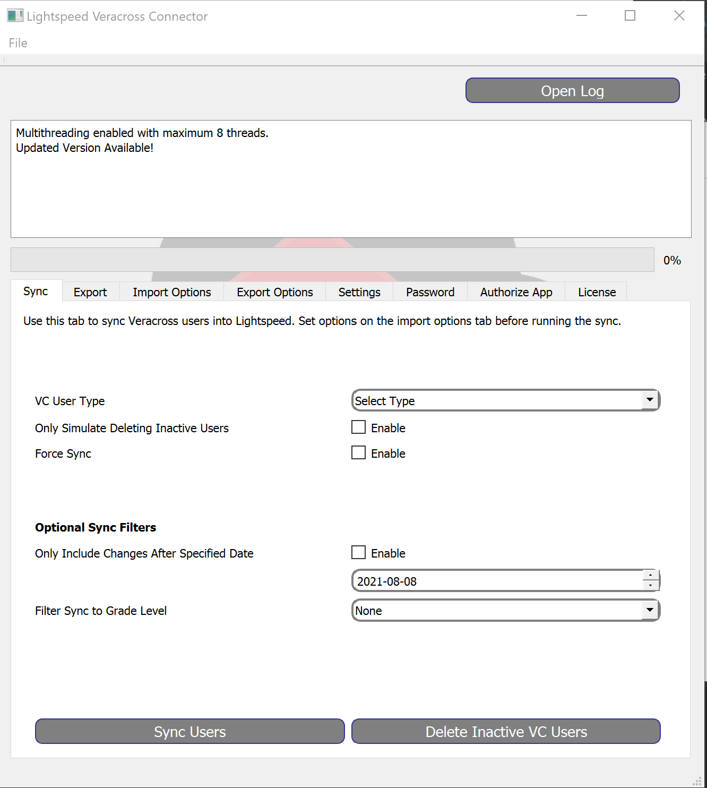
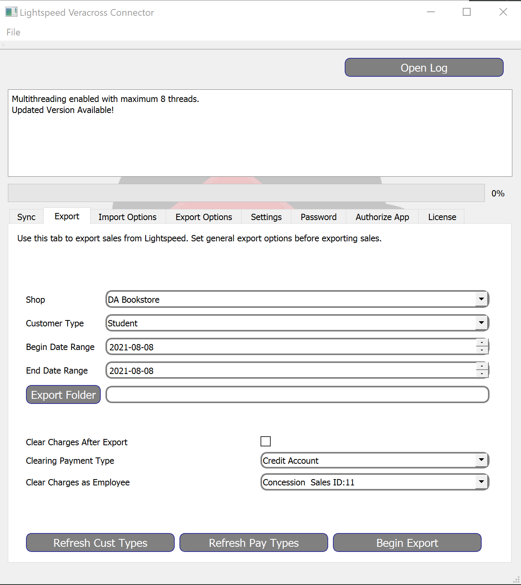
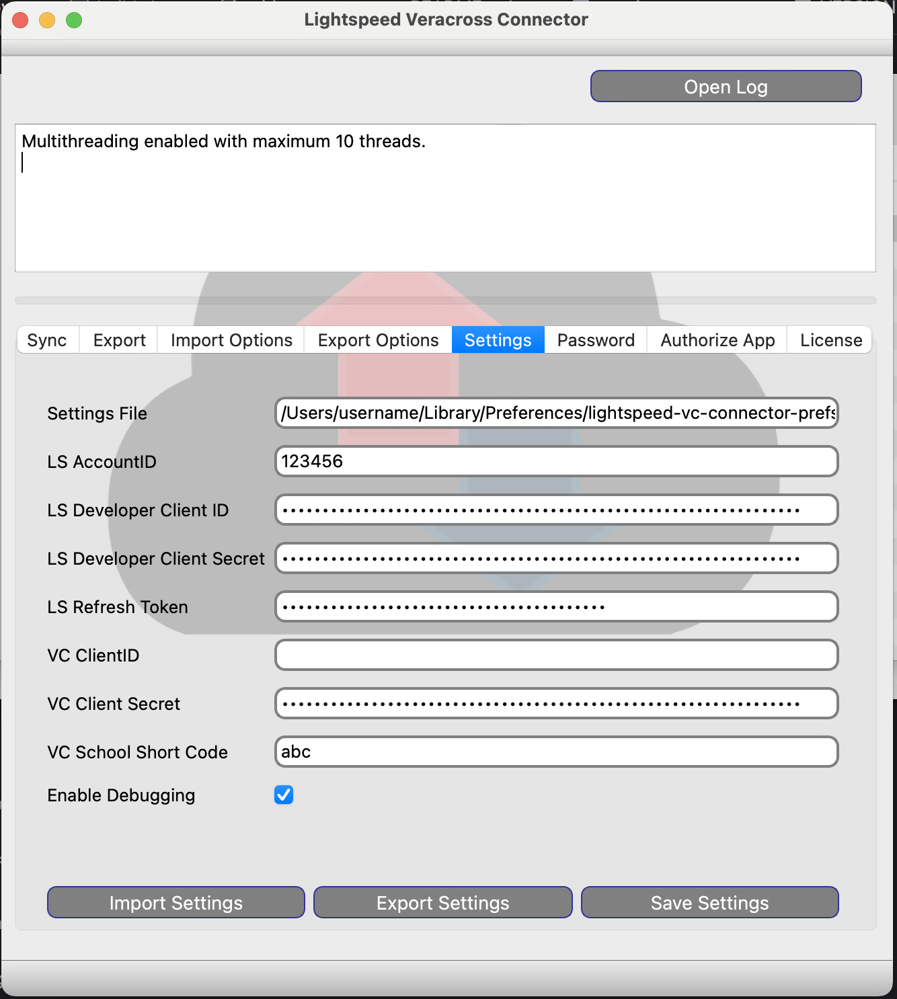
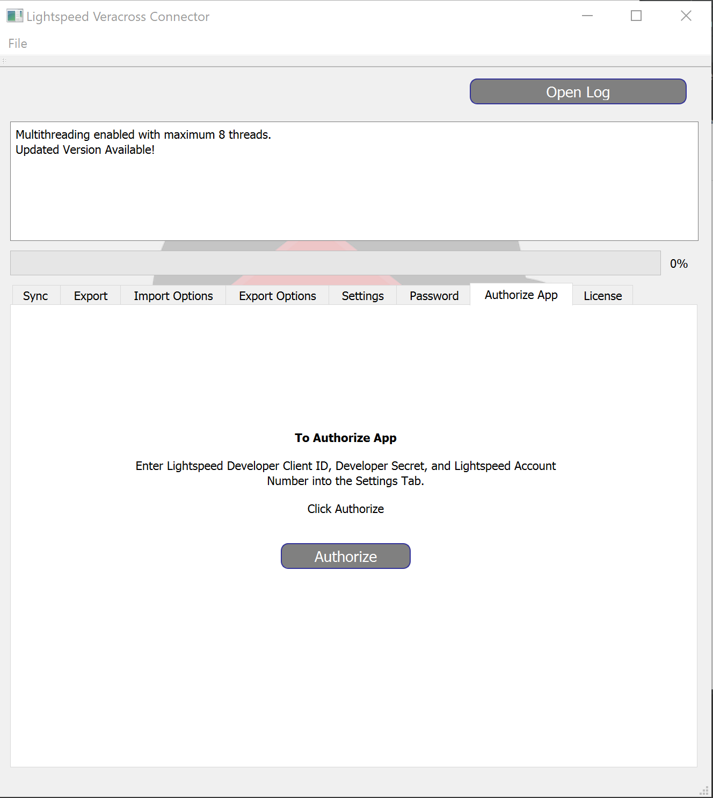

# Veracross and Lightspeed HQ POS Sync Connector

This is a PyQT application developed to provide integration between Veracross and Lightspeed.

For more information see 

[Features](#features)

[Known Issues](#known-issues)

[Screenshots](#screenshots)

[Getting Started](#getting-started)

### Features
* Settings are encrypted in AES256-CBC.
* Create and update customers in Lightspeed directly from Veracross API.
* Create and update customers that have been updated in VC after a specific date.
* Create and update customers based on Veracross Grade Level.
* Delete customers that are no longer in Veracross and do not have a credit balance.
* Export charges from Lightspeed in a CSV format that is importable by VC Importer.
* Export charges by individual sale items, or credit balance total.
* Filter export of charges by individual shop.
* Clear charge accounts back to zero by applying an exact credit after exporting. The balance total is used to reverse the
amount on account.
* Easily authorize the application using your own Lightspeed Developer account and your Lightspeed Retail account.
* Veracross ID stored in LS Custom field for looking up customers by barcode.

### Known Issues
* Export of individual SaleLines as opposed to the entire invoice total will round the totals differently. 
Currency fields are stored in Lightspeed to the thousandth of a cent.  This means that the invoice total could be rounded 
differently than rounding each individual item.  This is only been noticed when charging tax in Lightspeed.
* Multi-Tender On Account Sales: Because each item on an invoice is not associated with the payment type, it is best to 
avoid mixing credit account sales with other payment types.  The export will find all invoices that have been paid (fully/partially)
by a credit account. So you run the risk of charging the customer twice. The amount paid with the other tender type will be ignored
and imported into Veracross.
* Selling Gift Cards on account has been known to cause problems when importing into Veracross.  It is best to either avoid 
Gift Cards all together or do not use the credit account as a way to purchase the gift card. 

### Screenshots

### How to Get Started
1) Create two CustomerTypes in your Lightspeed shop for Veracross Students and Faculty named **Student** and **FacultyStaff**

2) Create two custom fields in Lightspeed, both Customer Text fields. One named **Veracross ID** and the other named **Last Sync**.
* You can use any name you want for the text fields.

3) [Signup with Lightspeed OAuth](https://cloud.lightspeedapp.com/oauth/register.php).
* You will run the application under your own Lightspeed developer account/application.
* Be sure to set the redirect URI to http://localhost . This will leave the refresh token in the browser window for the app to capture.

4) Obtain Veracross API credentials from Veracross Account Rep.
    
5) Run the application.  You will be prompted for a password.  This password will be used for encrypting the new settings file.

6) On the settings tab, enter:
* LS Account ID Number (Click Username when logged into Lightspeed)
* LS Developer Client Developer ID
* LS Developer Client Secret
* VC Username
* VC Password
* VC URL (https://api.veracross.com/{schoolcode}/v2/)

7) Click Save Settings and restart the application.

8) Go to the Authorize Tab and click the Authorize Button.  Login to Lightspeed using your admin login id and password.

9) Grant your application access to the account. 

10) Restart the application.

11) Set the field names from #2 in the import options tab.

Do your first Sync!
